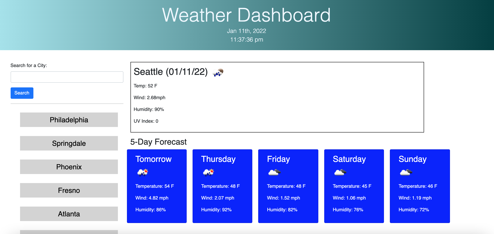

# weather-dashboard

# Description

This web app allows a user to search for a city and be presented with weather info for that location.
The app will also save searches in local storage so the user can quickly return back to a previously reviewed city. I used OpenWeather's current weather API call to get the coordinates of the city input and then the One Call API to get the advanced weather info. 

I struggled more on this assignment than any other so far. Parsing through the data was hard, as well as using the proper jquery selector to modify my elements. DOM element vs HTML element? Is there a difference? Is that why .text() sometimes works and sometimes doesn't? Still learning I guess. My most recent search doesn't show up as a button until the page is refreshed either. If I do .insertBefore() it hides the entire list until page is refreshed

# link

https://hcweigand10.github.io/weather-dashboard/

# screenshot

